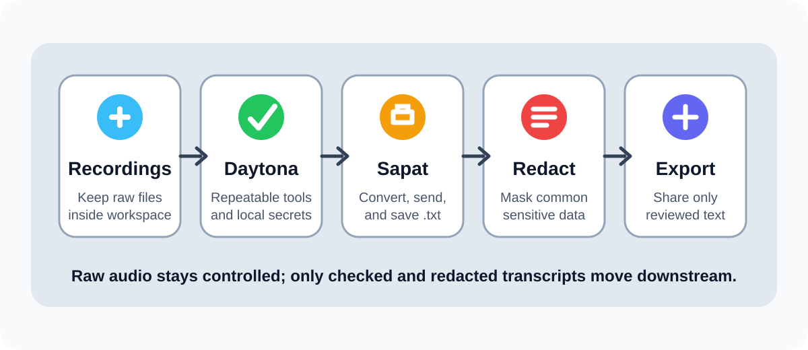

# Run Privacy-First AI Transcription With Sapat

## Introduction

AI transcription is useful because it turns recordings into searchable,
summarizable text. It is also risky because recordings often contain details
that were never meant to leave the team that captured them: phone numbers,
customer names, email addresses, account identifiers, ticket references, access
tokens spoken aloud during debugging, or internal project names.

This guide shows a practical workflow for running
[`nkkko/sapat`](https://github.com/nkkko/sapat) inside a reproducible
[Daytona workspace](</definitions/20240819_definition_daytona workspace.md>)
while keeping privacy controls close to the source files. You will create a
workspace, configure one transcription provider, run Sapat against a controlled
recording, review the transcript, apply a local
[transcript redaction](</definitions/20260520_definition_transcript_redaction.md>)
step, and export only the redacted text.

The goal is not to build a full compliance system. The goal is a simple
engineering loop that helps teams avoid the most common mistake in AI
transcription projects: treating raw transcripts as safe just because they are
plain text.

## TL;DR

- **Run Sapat inside Daytona** so the transcription workflow is repeatable.
- **Keep secrets in `.env`** and keep `.env`, recordings, and raw transcripts out of Git.
- **Use one provider per run** with Sapat's `--api openai`, `--api groq`, or `--api azure` option.
- **Review raw transcripts locally** before summarizing, indexing, or sharing them.
- **Redact common sensitive values** into a separate output file and move only that reviewed file downstream.

## What Sapat Does in This Workflow

Sapat is a Python command-line tool for transcribing video files with Azure
OpenAI, Groq, or OpenAI. Its current CLI accepts either a single file or a
directory. When you pass a directory, it processes the `.mp4` files in that
directory. For each recording, Sapat uses `ffmpeg` to create a temporary MP3,
sends that MP3 to the selected transcription provider, writes a `.txt` file
beside the original recording, and then removes the temporary MP3.

That shape is helpful for a privacy-first workflow:

| Stage | What happens | Privacy control |
| --- | --- | --- |
| Source recording | The `.mp4` file stays in the workspace | Do not commit recordings |
| Temporary audio | Sapat creates an MP3 for provider upload | Confirm provider and file size before the run |
| Raw transcript | Sapat writes a `.txt` file beside the source | Review locally before sharing |
| Redacted transcript | A separate script masks common sensitive values | Export only this reviewed copy |



Sapat is not a data-loss prevention product. It will not know whether a phrase
is confidential to your company. The safe pattern is to treat the raw transcript
as sensitive until a person or a local review script has checked it.

## Materials Checklist

Before you start, prepare:

- a machine with [Daytona](https://github.com/daytonaio/daytona) installed;
- access to a Git provider from Daytona;
- Python 3.6 or newer in the workspace;
- `ffmpeg` available in the workspace image;
- one API key for OpenAI, Groq, or Azure OpenAI;
- one short test recording that is safe to use for setup;
- a decision about where redacted transcripts are allowed to go.

Use a synthetic or non-sensitive recording for the first run. Do not test a new
transcription flow with a real support call, legal conversation, patient note,
or customer interview.

## Step 1: Create the Daytona Workspace

Create a workspace from the Sapat repository:

```bash
daytona create https://github.com/nkkko/sapat --code
```

Open a terminal in the workspace and inspect the project:

```bash
ls
find src/sapat -maxdepth 3 -type f | sort
```

The files to notice are:

- `src/sapat/script.py`, which defines the CLI options;
- `src/sapat/transcription/base.py`, which converts video to MP3 and writes the transcript;
- `src/sapat/transcription/openai.py`, `groq.py`, and `azure.py`, which send the audio to the selected provider.

Install the project dependencies:

```bash
python -m venv .venv
source .venv/bin/activate
pip install -r requirements.txt
pip install -e .
```

Check that the CLI is available:

```bash
sapat --help
```

You should see options such as `--language`, `--prompt`, `--temperature`,
`--quality`, `--correct`, and `--api`.

## Step 2: Configure One Provider

Create a local `.env` file in the workspace. Choose one provider for the first
run. Starting with one provider keeps the audit trail clear.

For OpenAI:

```env
OPENAI_API_KEY=your_openai_api_key
OPENAI_MODEL=whisper-1
OPENAI_API_ENDPOINT=https://api.openai.com/v1/audio/transcriptions
OPENAI_MODEL_NAME_CHAT=gpt-4o
```

For Groq:

```env
GROQCLOUD_API_KEY=your_groq_key
GROQCLOUD_MODEL=whisper-large-v3-turbo
GROQCLOUD_API_ENDPOINT=https://api.groq.com/openai/v1/audio/transcriptions
GROQCLOUD_MODEL_NAME_CHAT=llama3-8b-8192
```

For Azure OpenAI:

```env
AZURE_OPENAI_API_KEY=your_azure_api_key
AZURE_OPENAI_ENDPOINT=https://your-resource.openai.azure.com
AZURE_OPENAI_DEPLOYMENT_NAME_WHISPER=whisper
AZURE_OPENAI_API_VERSION_WHISPER=2024-06-01
AZURE_OPENAI_DEPLOYMENT_NAME_CHAT=gpt-4o
AZURE_OPENAI_API_VERSION_CHAT=2023-03-15-preview
```

Then protect local files from accidental commits:

```bash
cat >> .git/info/exclude <<'EOF'
.env
recordings/
transcripts/
redacted/
*.mp3
*.mp4
*.txt
EOF
```

Using `.git/info/exclude` keeps the ignore rule local to your workspace. That is
useful when you do not want to change the upstream project just to protect your
test files.

## Step 3: Prepare a Controlled Recording Folder

Create folders for the workflow:

```bash
mkdir -p recordings transcripts redacted review
```

Put one short `.mp4` file in `recordings/`. For the first run, use a synthetic
recording such as a short product demo you created specifically for testing.

Create a run note before uploading anything:

```bash
cat > review/20260520-first-run.md <<'EOF'
# First Sapat transcription run

Provider: openai
Input file: recordings/demo.mp4
Approved for provider upload: yes
Contains customer data: no
Contains secrets or credentials: no
Allowed downstream destination: redacted transcript only
Reviewer: add-your-name
EOF
```

This note looks simple, but it forces the most important decision before the
provider call: is this recording allowed to leave the workspace for
transcription?

## Step 4: Run Sapat

Run Sapat against the file:

```bash
sapat recordings/demo.mp4 \
  --api openai \
  --quality M \
  --language en \
  --prompt "Technical walkthrough. Preserve product names, acronyms, dates, and ticket IDs." \
  --temperature 0.3
```

Replace `openai` with `groq` or `azure` if that is the provider you configured.

Sapat should produce:

```text
recordings/demo.txt
```

Move the raw transcript into the working transcript folder:

```bash
mv recordings/demo.txt transcripts/demo.raw.txt
```

Read the transcript locally:

```bash
sed -n '1,160p' transcripts/demo.raw.txt
```

At this point, do not summarize it with another model and do not paste it into a
ticket, document, chat, or search index. Treat it like the source recording
until it has passed review.

## Step 5: Add a Local Redaction Step

Create a small redaction script:

```bash
cat > redact_transcript.py <<'PY'
from pathlib import Path
import re
import sys

PATTERNS = [
    ("email", re.compile(r"\\b[A-Za-z0-9._%+-]+@[A-Za-z0-9.-]+\\.[A-Za-z]{2,}\\b")),
    ("phone", re.compile(r"(?<!\\d)(?:\\+?\\d[\\d .()\\-]{7,}\\d)(?!\\d)")),
    ("token", re.compile(r"\\b(?:sk|pk|ghp|gho|xoxb|AKIA)[A-Za-z0-9_\\-]{12,}\\b")),
    ("card", re.compile(r"\\b(?:\\d[ -]*?){13,19}\\b")),
]

if len(sys.argv) != 3:
    print("usage: redact_transcript.py INPUT_FILE OUTPUT_FILE")
    raise SystemExit(2)

source = Path(sys.argv[1])
target = Path(sys.argv[2])

text = source.read_text(encoding="utf-8")
counts = {}

for label, pattern in PATTERNS:
    text, count = pattern.subn(f"[REDACTED_{label.upper()}]", text)
    counts[label] = count

target.parent.mkdir(parents=True, exist_ok=True)
target.write_text(text, encoding="utf-8")

print("redaction summary")
for label, count in counts.items():
    print(f"{label}: {count}")
PY
```

Run it:

```bash
python redact_transcript.py transcripts/demo.raw.txt redacted/demo.redacted.txt
```

Review the output:

```bash
sed -n '1,160p' redacted/demo.redacted.txt
```

This script is intentionally conservative and easy to inspect. It catches common
patterns, not every possible sensitive phrase. Add project-specific terms to the
script when your team knows what must be masked, such as customer names, internal
repository names, contract IDs, or unreleased product names.

## Step 6: Compare Raw and Redacted Output

Use a local diff before exporting the text:

```bash
diff -u transcripts/demo.raw.txt redacted/demo.redacted.txt | sed -n '1,120p'
```

Then update the run note:

```bash
cat >> review/20260520-first-run.md <<'EOF'

Raw transcript reviewed: yes
Redaction script run: yes
Redacted transcript manually checked: yes
Export approved: yes
EOF
```

Only the file in `redacted/` should move to the next step of your workflow. That
next step might be a summary, a support knowledge base article, a search index,
or a retrieval-augmented generation pipeline. The raw recording and raw
transcript should stay in the workspace or in the controlled storage location
your team already uses for sensitive data.

## Optional: Use Sapat's Correction Pass Carefully

Sapat includes a `--correct` option that sends the transcript text to a chat
model for cleanup. That can improve punctuation and product spelling, but it is
also another model call. Use it only after you have decided that the transcript
content is allowed to go through that provider.

Example:

```bash
sapat recordings/demo.mp4 \
  --api groq \
  --quality M \
  --language en \
  --prompt "Technical support call. Preserve product names and ticket IDs." \
  --temperature 0.3 \
  --correct
```

If you use `--correct`, run the same redaction and review steps against the
corrected `.txt` file. A correction pass can add punctuation, but it can also
rewrite wording. Do not assume corrected text is safer than raw text.

## Common Issues and Troubleshooting

**Problem:** `ffmpeg` is not found.

**Solution:** Install `ffmpeg` in the workspace image or use a dev container
that includes it. Sapat depends on `ffmpeg` for the MP3 conversion step.

**Problem:** Sapat processes no files when you pass a directory.

**Solution:** Confirm that the recordings use the `.mp4` extension. The current
directory mode looks for `.mp4` files.

**Problem:** The provider rejects the file.

**Solution:** Try `--quality L` to create a smaller MP3, split long recordings,
or test a short clip first. Sapat's OpenAI and Groq adapters also include a
local file-size check before upload.

**Problem:** The transcript keeps misspelling product names.

**Solution:** Add a focused `--prompt` with the exact names, acronyms, and
domain terms that should be preserved. Change one option at a time so you can
tell whether the prompt, temperature, provider, or audio quality caused the
improvement.

**Problem:** The redaction script misses a sensitive phrase.

**Solution:** Add a project-specific pattern and rerun the script. Generic
regexes are only a first pass. Human review is still required for sensitive
workflows.

## Conclusion

A useful transcription workflow is not just a command that creates a `.txt`
file. It is a controlled path from recording to reviewed text. Daytona gives the
workflow a repeatable workspace, Sapat handles the provider-specific
transcription call, and a local redaction step gives teams a safer artifact to
share downstream.

The important habit is simple: keep raw recordings and raw transcripts private,
document each provider upload decision, and export only text that has been
reviewed and redacted for its intended destination.

## References

- [Sapat repository](https://github.com/nkkko/sapat)
- [Daytona repository](https://github.com/daytonaio/daytona)
- [Daytona content contribution guide](https://github.com/daytonaio/content/blob/main/CONTRIBUTING.md)
